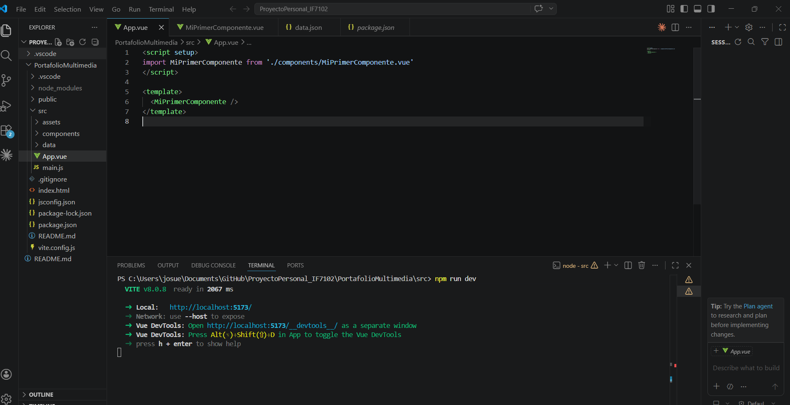
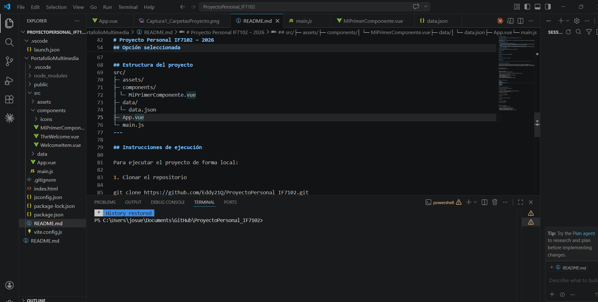
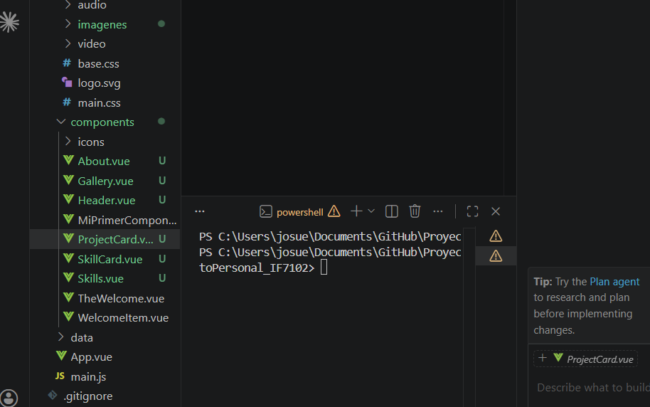
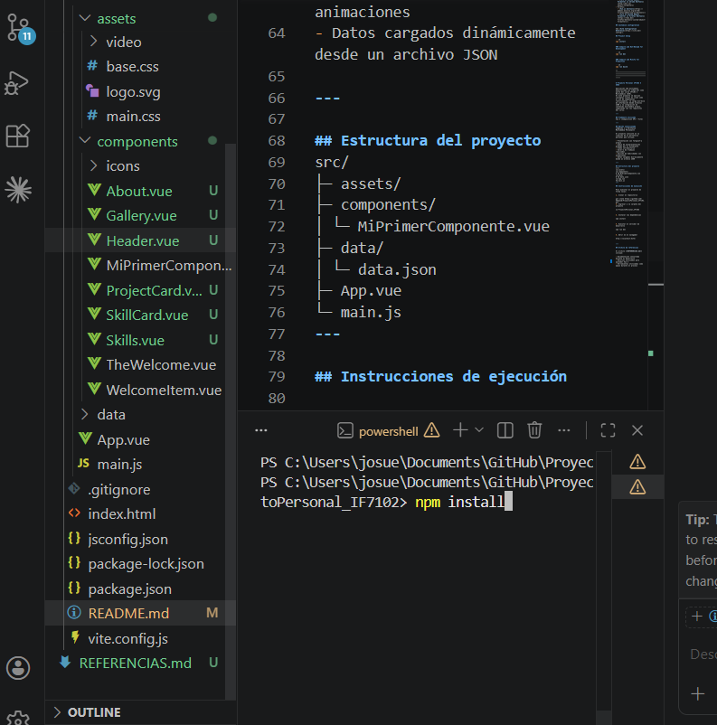
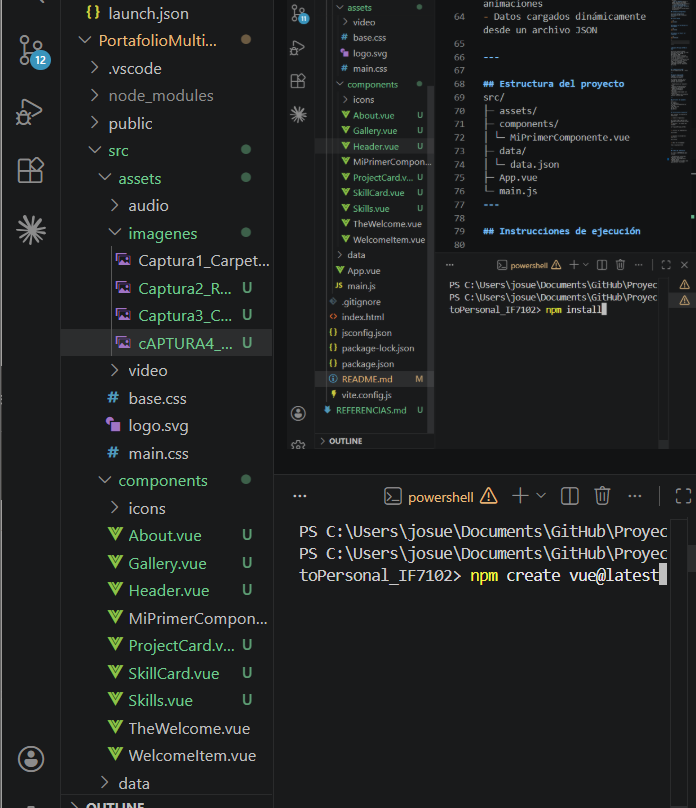
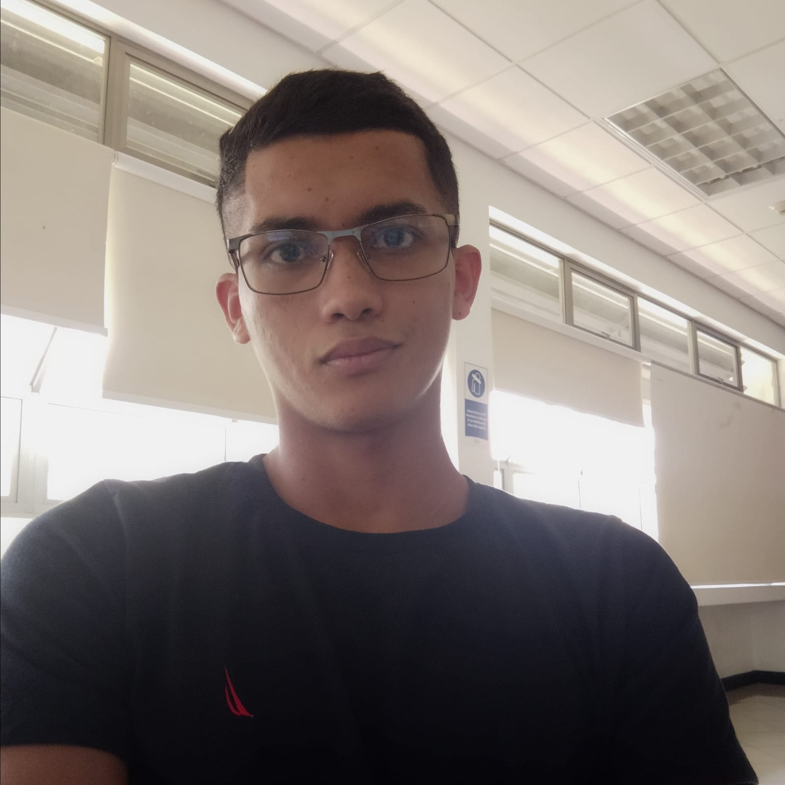

# Proyecto Personal IF7102 - Portafolio Multimedia

Aplicacion web multimedia desarrollada con **Vue 3** y **Vite** para el curso IF7102 Multimedios, I Ciclo 2026. El proyecto corresponde a la opcion **Portfolio Multimedia Personal** y presenta informacion profesional del estudiante mediante componentes reutilizables, datos cargados desde JSON y recursos multimedia propios.

---

## Framework Utilizado

- **Vue 3**
- **Composition API**
- **Vite**
- **JavaScript**
- **HTML y CSS**

---

## Opcion Seleccionada

**Opcion 1 - Portfolio Multimedia Personal**

El proyecto incluye:

- Presentacion personal con fotografia propia.
- Audio de autopresentacion grabado por el estudiante.
- Video introductorio personal.
- Galeria de proyectos o evidencias del proceso.
- Seccion de habilidades con animaciones.
- Datos cargados dinamicamente desde `public/data/data.json`.

---

## Funcionalidades Implementadas

- Componentes por seccion: `Header`, `About`, `Gallery` y `Skills`.
- Componentes reutilizables: `ProjectCard` y `SkillCard`.
- Uso de `props` para enviar datos desde componentes padres hacia componentes hijos.
- Uso de `defineEmits` para emitir eventos desde tarjetas hacia sus componentes padres.
- Uso de `v-for` para renderizar listas de proyectos y habilidades.
- Uso de `ref` y `onMounted` para manejar reactividad y ciclo de vida.
- Carga de datos desde JSON mediante `fetch`.
- Seleccion visual de proyectos y habilidades.
- Barras animadas para representar niveles de habilidad.
- Diseno responsive para pantallas de escritorio y moviles.

---

## Estructura Principal del Proyecto

```txt
PortafolioMultimedia/
├── public/
│   ├── audio/
│   │   └── presentacion.mp3
│   ├── data/
│   │   └── data.json
│   ├── imagenes/
│   │   ├── Captura1_CarpetasProyecto.png
│   │   ├── Captura2_Readme.png
│   │   ├── Captura3_ComponentesPortafolio.png
│   │   ├── Captura4_npmInstall.png
│   │   ├── Captura5_npmcreatevue.png
│   │   └── Captura6_fotopersonal.png
│   └── video/
│       └── intro.mp4
├── src/
│   ├── assets/
│   │   └── base.css
│   ├── components/
│   │   ├── About.vue
│   │   ├── Gallery.vue
│   │   ├── Header.vue
│   │   ├── ProjectCard.vue
│   │   ├── SkillCard.vue
│   │   └── Skills.vue
│   ├── App.vue
│   └── main.js
├── package.json
└── vite.config.js
```

Nota: los archivos `presentacion.mp3` e `intro.mp4` deben colocarse en las carpetas indicadas para activar los reproductores multimedia.

---

## Instrucciones de Ejecucion

Desde la raiz del repositorio:

```sh
cd PortafolioMultimedia
npm install
npm run dev
```

Luego abrir en el navegador la URL indicada por Vite. Normalmente es:

```txt
http://localhost:5173/
```

Para generar una version de produccion:

```sh
npm run build
```

---

## Capturas de Pantalla

### Estructura del proyecto



### README del proyecto



### Componentes del portafolio



### Instalacion con npm



### Creacion del proyecto Vue



### Fotografia personal



---

## Componentes del Proyecto

### `Header.vue`

Muestra la navegacion principal hacia las secciones Sobre mi, Galeria y Habilidades.

### `About.vue`

Carga desde JSON la informacion personal, fotografia, audio y video. Utiliza `fetch`, `ref` y `onMounted`.

### `Gallery.vue`

Carga la lista de proyectos desde JSON, renderiza tarjetas con `v-for` y mantiene un proyecto seleccionado mediante reactividad.

### `ProjectCard.vue`

Recibe un proyecto mediante `props` y emite el evento `select` cuando el usuario selecciona una tarjeta.

### `Skills.vue`

Carga habilidades desde JSON, renderiza la lista con `v-for` y muestra la habilidad seleccionada.

### `SkillCard.vue`

Recibe una habilidad mediante `props`, muestra su nivel porcentual y emite el evento `focus-skill` al seleccionarla.

---

## Archivo de Referencias

El archivo `REFERENCIAS.md`, ubicado en la raiz del repositorio, documenta:

- Documentacion oficial consultada.
- Tutoriales y cursos utilizados para aprender Vue 3.
- Herramientas del entorno de desarrollo.
- Recursos multimedia usados y su licencia.
- Uso de IA como apoyo.
- Referencias en formato APA 7.

---

## Estado Actual

El proyecto puede ejecutarse con `npm install` y `npm run dev`. La fotografia y las capturas ya estan incluidas. El audio y el video deben agregarse posteriormente en:

```txt
public/audio/presentacion.mp3
public/video/intro.mp4
```
